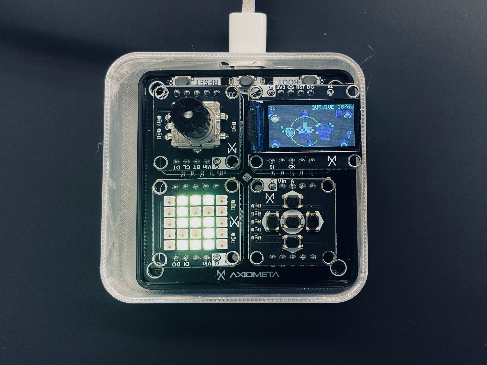
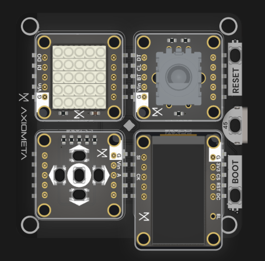

# INFINITE CARTRIDGE

*An endless Game Boy, built over a weekend for the Axiometa × Anthropic × Unicorn Mafia hackathon.*

[](https://x.com/poltarakii/status/2078947877930295725)

**[▶ Watch the demo here!](https://x.com/poltarakii/status/2078947877930295725)**

The C++ engine is fixed, but everything above it is generative. Levels never repeat: not for you, not for anyone else playing (inspired by No Man's Sky planets). An ontology randomises the games: 13,662 discrete skeletons × up to 10⁷ parameter variations works out to billions of games. It rolls the dice and hands the spec to three Claude (Sonnet) agents: a **designer**, a **programmer** and a **composer**. The designer picks 8×8 sprites and lays out the level as an ASCII matrix; the programmer writes the game in Arduino C; the composer writes MIDI, converted to PT3 and played during the game on an AY-3-8912, the OG analog sound chip from the '80s ZX Spectrum. While you play one round, the agents are already implementing the next one. Win or lose, it flashes you a new game the moment you finish.

## How it works

- **Ontology** (`ontology.py`): Python rolls genre, objective, threat, twist, pace, weighted setting, avatar, 25% wildcard and numeric params. Anti-repeat memory bends every roll, and games are winnable by construction (10 lives, capped difficulty ramps, goals sized to the spawn economy).
- **Designer**: skins the roll with a title, a blurb, a sprite cast drawn from a ~360-sprite hand-named atlas, and a 20×8 ASCII level map (collisions, terrain, spawn points).
- **Programmer**: writes ~150 lines of Arduino C++ against `ENGINE_PROMPT.md`, which is simultaneously the human docs and, verbatim, the system prompt. Every game passes a static contract check, a real `arduino-cli` compile, and up to 3 repair rounds with the compiler's errors fed back.
- **Composer**: writes a strict-JSON score (3 voices + drums on a 16th-note grid) → MIDI → `.pt3`, uploaded over HTTP to a Raspberry Pi driving the AY chip, which plays each game's theme the moment it flashes.
- **The loop** (`main.py --loop`): a pipelined producer authors game N+1 while game N compiles, keeps a 10-game buffer, and flashes prebuilt binaries in ~10 s on every game-over.
- **Firmware** (`forge_sketch/engine.h`): the whole console, from the 160×80 ST7735 framebuffer and PICO-8 palette to the d-pad + encoder input, the NeoPixel lives matrix and the 30 fps shell. A generated game is just `gameInit` / `gameUpdate` / `gameDraw`.

## Running it

```bash
pip install -r requirements.txt
arduino-cli core update-index && arduino-cli core install esp32:esp32
arduino-cli lib install "Adafruit GFX Library" "Adafruit ST7735 and ST7789 Library" "Adafruit NeoPixel"
cp example.env .env        # set ANTHROPIC_API_KEY (+ ZX_SPECTRUM_CHIP_URL for music)

python main.py --theme "crabs in space"   # forge one game and flash it
python main.py --loop                     # endless mode: a fresh game on every game-over
python main.py --pregen 5                 # bank games into library/ without flashing
python main.py --flash library/<cart>     # reflash a banked game
python main.py --list                     # browse the library
python gui.py                             # web GUI over the same verbs
```

## Hardware

An [Axiometa](https://axiometa.io) Genesis Mini handheld (ESP32-S3): TFT screen, d-pad, encoder and a 5×5 LED matrix as snap-together modules. Music plays on a real AY-3-8912 behind a small HTTP server. No music box configured = games ship silent.



## References & gratitude

The 8-bit ZX Spectrum music is only possible thanks to **[PapAYa](https://github.com/gasman/papaya)** by **Matt Westcott (gasman)**: an open-source Raspberry Pi header carrying two AY-3-8912 chips, published with both the code and the KiCad files. I ported gasman's code to the Raspberry Pi 5 for another project of mine that's currently in progress, and will open-source that port later, together with the HTTP server add-on vibe-coded during this hackathon.

The games are drawn with a curated set of sprites from these packs:

- [Paper Pixels](https://v3x3d.itch.io/paper-pixels) by VEXED
- [Micro Roguelike](https://kenney.nl/assets/micro-roguelike), [PICO-8 Platformer](https://kenney.nl/assets/pico-8-platformer) and [Racing Pack](https://kenney.nl/assets/racing-pack) by Kenney
- [Dungeon Tileset II](https://0x72.itch.io/dungeontileset-ii) by 0x72
- [8x8 PICO-8 Tile Set 1](https://opengameart.org/content/8x8-pico-8-tile-set-1) by hawkbirdtree
- [Chicken Sprites](https://opengameart.org/content/chicken-sprites) by Shepardskin
- [Scallywag Ships](https://foozlecc.itch.io/scallywag-ships) and [Void Main Ship](https://foozlecc.itch.io/void-main-ship) by Foozle
- [Animated Mafia Guys](https://printer-not-found.itch.io/animated-mafia-guys-free-cc0) by Printer Not Found
- [Goose](https://duckhive.itch.io/goose) by DuckHive
- [CreatorPack](https://jonathan-so.itch.io/creatorpack) by Jonathan So
- [City](https://piiixl.itch.io/city) by PIIIXL

Every pixel on the little screen exists because someone drew it with care and gave it away. Support indie designers and developers; their craft is what makes weekend projects like this possible.
